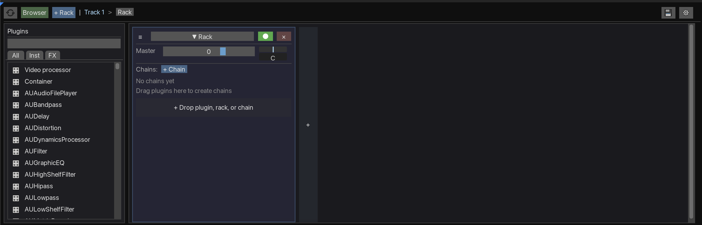

# SideFX

Ableton/Bitwig-style FX rack management for REAPER 7+.

## Features

- **Horizontal device chain** - Visual rack-style FX management
- **Parallel processing racks** - Create parallel chains with per-chain mixing
- **LFO modulators** - Modulate any parameter with custom bezier curves
- **Bake to automation** - Convert modulator movement to REAPER envelopes
- **Smart parameter display** - Auto-detect units (dB, Hz, ms) with configurable overrides
- **Preset system** - Save/load entire FX chain configurations
- **Plugin browser** - Search and filter plugins, drag to add

## Requirements

- **REAPER 7.0+**

### Dependencies (Install via ReaPack)

| Package | Repository | Required For |
|---------|------------|--------------|
| ReaImGui | ReaTeam Extensions | UI framework |
| ReaWrap | Conceptual Machines | OOP wrapper library |
| RPP-Parser | ReaTeam Scripts | Preset save/load |
| EmojImGui | ReaTeam Scripts | Icon support |
| js_ReaScriptAPI (optional) | ReaTeam Extensions | Custom preset folder selection |

> **Note:** Dependencies must be installed manually via ReaPack before installing SideFX.

## Installation

### Via ReaBoot (Easiest)

[ReaBoot](https://reaboot.com/) can install SideFX and all dependencies automatically.

### Via ReaPack

1. Install all dependencies listed above from ReaPack
2. Add this repository: `https://raw.githubusercontent.com/Conceptual-Machines/SideFX/main/index.xml`
3. Install "SideFX" from the ReaPack browser
4. Restart REAPER

## Usage

1. Select a track
2. Run the SideFX action from the Actions menu
3. Use the plugin browser to add devices
4. Create racks for parallel processing
5. Add modulators to automate parameters

See the [full documentation](https://conceptual-machines.github.io/SideFX/) for detailed guides.

## Known Issues

### Multiple Serum instances don't receive MIDI

When using multiple Serum (or Serum 2) instances on the same track, only the first instance receives MIDI by default. This is because REAPER's VST instruments default to "Replace MIDI bus" mode instead of "Merge with MIDI bus".

**Workaround:** For each additional Serum instance:
1. Open the FX window for the Serum plugin
2. Click the **I/O** button (routing)
3. Under **MIDI Output**, select **"Merges with MIDI bus"**

This setting is not exposed via REAPER's scripting API, so SideFX cannot set it automatically.

## Documentation

📖 **[Online Manual](https://conceptual-machines.github.io/SideFX/)**

## License

MIT License - see [LICENSE](LICENSE)

## Author

Nomad Monad
